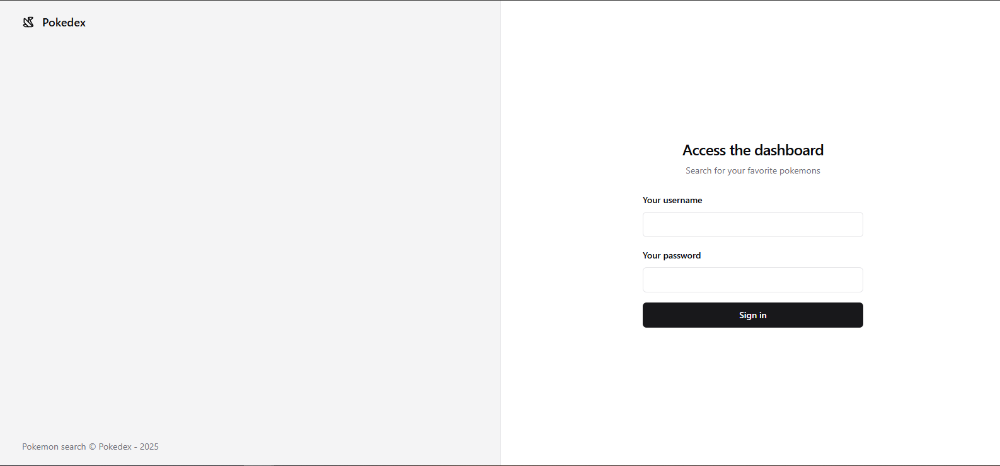
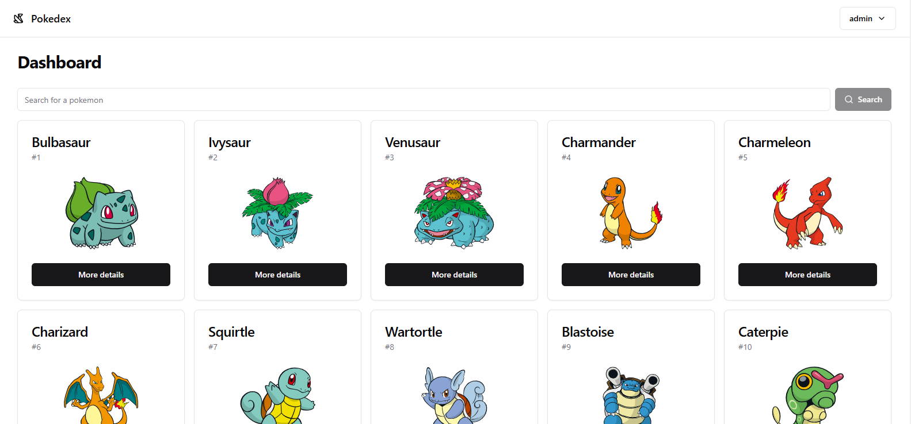
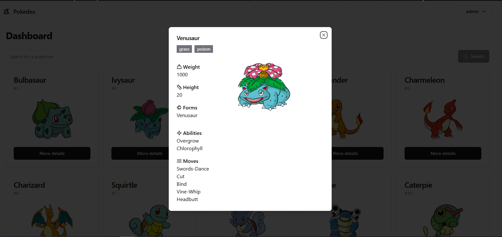

# Pokedex | Pokemon Search

### :bulb: Description

This application, called *Pokedex*, is a Pokemon search tool where you can look for any Pokemon you want. To access the application, you need to have login credentials.



After logging in, you'll see a small list of up to 10 Pokémon at the top. You can search for any Pokémon, or simply click on the pagination at the bottom of the page to continue viewing the list.



If you want to know more about a Pokémon from the list, just click on the **More Details** button. It will open a modal with more information.



This application is also fully responsive, so you can use it on smaller devices. Enjoy! You can access it [here](https://pokedex-drab-sigma-94.vercel.app/sign-in)

### :computer: APIs
- [PokéAPI](https://pokeapi.co/)

### :rocket: Technologies

- Developed with [Vite](https://vitejs.dev/), [ReactJS](https://react.dev/learn) and [TypeScript](https://www.typescriptlang.org/)
- Styled with [Tailwind](https://tailwindcss.com/) and [Shadcn UI](https://ui.shadcn.com/)
- Form validation with [React Hook Form](https://www.react-hook-form.com/) and [Zod](https://zod.dev/)
- Data fetching with [React Query](https://tanstack.com/query/latest/docs/framework/react/overview)
- Unit tests with Vitest and [React Testing Library](https://testing-library.com/docs/react-testing-library/intro/)

I created this project using Vite combined with React and TypeScript because they offer a robust framework for building any project. TypeScript adds security and scalability to keep the code clean and maintainable for future features, while ensuring excellent performance.

I chose Shadcn UI to help me with most of the component designs. I have used it in past projects, so I didn't encounter any issues using it for Pokedex. This allowed me to focus on the functionality more quickly.

I wasn't able to create tests for all components due to time constraints, but I plan to improve this in the future.

### :hammer: Features
- [ ] Improve the detailed information for each Pokemon.
- [ ] Improve Pokemon search functionality.
- [ ] Improve responsive design.
- [ ] Increase unit tests and add E2E tests.

### :heavy_check_mark: Installation

- You need to have `node` version 19 or higher installed on your system.
- Clone this repository and then run `npm run install` to install the project dependencies.
- Run `npm run dev` to start the development server, and view the project running on `:5173` localhost port.
- Run `npm run build` and then `npm run preview` to see the production version.
- Run `npm run test` to execute the unit tests.

### :heavy_check_mark: How to access
- After running the project, you'll be redirected to the `/sign-in` route. Use the credentials provided at the end of this document to log in and access the dashboard.
- Once logged in, you will be redirected to the dashboard, where you can search for Pokémon, view details, and paginate through the list. You can also log out at any time using the log-out button in the top right corner.
---

#### :key: Credentials
```
username: admin
password: admin
```

---

Made with ❤️ by Pamela Santos :point_right: [Get in touch!](https://pamelasantos.dev.br/)